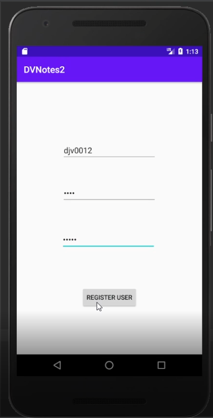
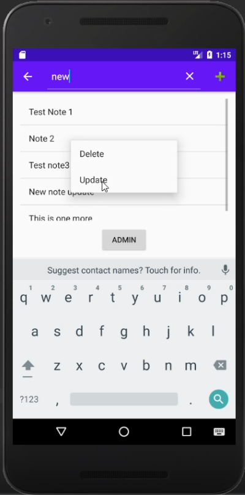
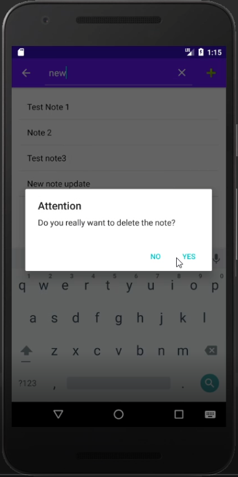
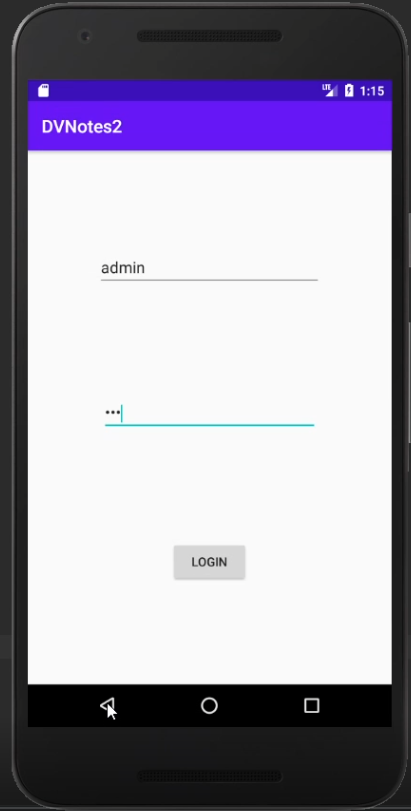
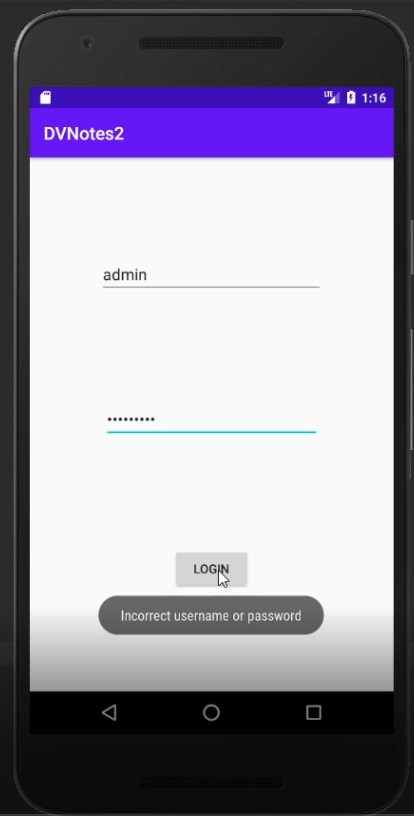
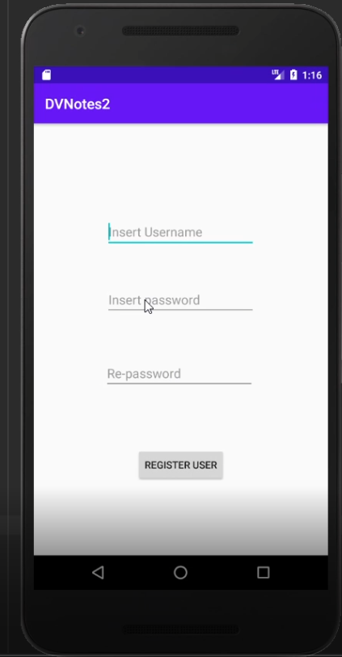
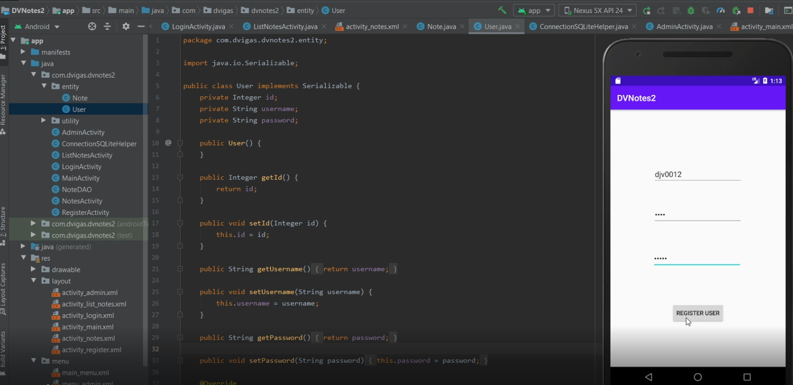

# DVNote2 App
Android-Java-App

### Notepad app with user and password
Application made in Android Studio with Java language and SQLite database.

### How does it work:
* The user has the possibility to create users and passwords for access control.
* Creating, reading, altering and erasing (CRUD) notes and users.
* Data is archived in the SQLite database locally on the device.
* The application is intuitive as shown in the images below.

Powered by DViga ❤️
 
---
 

## Screenshots of usage examples:

<!--

-->